# MCP Products Server

A Model Context Protocol (MCP) server that provides product search and marketing summary generation capabilities for the Cosmic Works Bike Company. This project includes both the MCP server and a Blazor client for easy testing and interaction.

## Features

### MCP Server

- **Product Search Tools**: Hybrid search capabilities (vector and full-text searching)
- **Product Summary Tools**: Generate, retrieve, update, and delete marketing summaries
- **HTTP Transport**: JSON-RPC over HTTP for easy integration
- **Comprehensive Logging**: Track tool invocations, parameters, and performance metrics
- **Azure Cosmos DB Integration**: Vector search and document storage
- **Azure OpenAI Integration**: AI-powered content generation

### Blazor Client

- **Interactive UI**: Modern web interface for testing MCP tools
- **Markdown Rendering**: Rich display of AI-generated responses
- **Real-time Logging**: See which tools are being invoked
- **Responsive Design**: Works on desktop and mobile devices

## Architecture

```mermaid
graph TB
    subgraph "Client Layer"
        BC[Blazor Client<br/>🖥️ User Interface<br/>📝 Markdown Rendering<br/>📊 Real-time Logging]
    end
    
    subgraph "MCP Layer"
        MCP[MCP Server<br/>🔧 Tool Registry<br/>📡 HTTP Transport<br/>📋 JSON-RPC Protocol]
    end
    
    subgraph "Semantic Kernel Layer"
        SK[Semantic Kernel<br/>🧠 AI Orchestration<br/>🔌 Plugin Management<br/>🤖 Agent Framework]
    end
    
    subgraph "Tool Layer"
        PT[Product Tools<br/>🔍 Search Functions<br/>📊 Data Retrieval]
        ST[Summary Tools<br/>✍️ Content Generation<br/>💾 CRUD Operations]
    end
    
    subgraph "Data Layer"
        CDB[(Azure Cosmos DB<br/>🗄️ Vector Database<br/>📄 Document Store)]
    end
    
    subgraph "External Services"
        AOI[Azure OpenAI<br/>🤖 LLM Services<br/>🧠 Embeddings]
    end
    
    BC <-->|HTTP/JSON-RPC| MCP
    MCP <-->|Plugin Integration| SK
    SK <-->|Function Calls| PT
    SK <-->|Function Calls| ST
    PT <-->|Data Operations| CDB
    ST <-->|Data Operations| CDB
    SK <-->|AI Services| AOI
    
    classDef clientLayer fill:#e1f5fe,stroke:#01579b,stroke-width:2px
    classDef mcpLayer fill:#f3e5f5,stroke:#4a148c,stroke-width:2px
    classDef skLayer fill:#e8f5e8,stroke:#1b5e20,stroke-width:2px
    classDef toolLayer fill:#fff3e0,stroke:#e65100,stroke-width:2px
    classDef dataLayer fill:#fce4ec,stroke:#880e4f,stroke-width:2px
    classDef externalLayer fill:#f1f8e9,stroke:#33691e,stroke-width:2px
    
    class BC clientLayer
    class MCP mcpLayer
    class SK skLayer
    class PT,ST toolLayer
    class CDB dataLayer
    class AOI externalLayer
```



## Prerequisites

- .NET 9.0 SDK
- Azure Cosmos DB account
- Azure OpenAI service (optional, for enhanced features)

## Semantic Kernel Integration

This solution leverages Microsoft Semantic Kernel to bridge the gap between MCP tools and AI-powered applications. Here's how it works:

### MCP to Semantic Kernel Plugin Mapping

The MCP server exposes tools that are automatically converted to Semantic Kernel plugins:

1. **Tool Discovery**: When the Blazor client initializes, it calls the MCP server's `tools/list` endpoint
2. **Plugin Conversion**: Each MCP tool is converted to a Semantic Kernel function using `tool.AsKernelFunction()`
3. **Plugin Registration**: All tools are registered as a single plugin named "MCPProducts" in the Semantic Kernel instance
4. **Function Invocation**: When the AI agent needs to use a tool, Semantic Kernel automatically calls the corresponding MCP tool

```csharp
// Example: MCP tool registration in the Blazor client
var tools = await _mcpClient.ListToolsAsync();
kernel.Plugins.AddFromFunctions("MCPProducts", tools.Select(x => x.AsKernelFunction()));
```

### Benefits of Semantic Kernel Integration

#### 1. **Intelligent Tool Selection**

- The AI agent can automatically choose which tools to use based on the user's request
- No need to manually map user intents to specific tool calls
- Supports complex multi-step workflows

#### 2. **Natural Language Processing**

- Users can ask questions in natural language: "Show me a list of mountain bikes"
- The agent understands context and can combine multiple tools
- Supports conversational interactions with memory and context (TODO: Add this to the demo)

#### 3. **Agent Framework**

- Built-in support for chat completion agents
- Automatic function calling with proper error handling
- Streaming responses for better user experience

#### 4. **Extensibility**

- Easy to add new MCP tools without changing the client code
- Plugins can be dynamically loaded and unloaded
- Support for custom function calling strategies

#### 5. **Observability**

- Built-in logging for function invocations
- Performance metrics and telemetry
- Debugging support for complex AI workflows

### Example Workflow

1. **User Input**: "Generate marketing copy for a mountain bike under $500"
2. **Agent Analysis**: Semantic Kernel analyzes the request and determines needed tools
3. **Tool Selection**: Agent selects `hybrid_search_products` to find relevant bikes
4. **Data Retrieval**: MCP tool queries Cosmos DB and returns product data
5. **Content Generation**: Agent uses `generate_product_summary` with the retrieved data
6. **Response**: Formatted marketing copy is saved to the database and returned to the user

This architecture provides a seamless integration between traditional API tools and AI-powered applications, enabling sophisticated, context-aware interactions.

## Setup

### 1. Clone the Repository

```bash
git clone <repository-url>
cd mcp-dotnet-2-complex
```

### 2. Configure Environment

Create `appsettings.Development.json` files in the following locations:

#### MCP Server (`mcp-products-server/appsettings.Development.json`)

```json
{
  "DetailedErrors": true,
  "Logging": {
    "LogLevel": {
      "Default": "Information",
      "Microsoft.AspNetCore": "Warning"
    }
  },
  "AllowedHosts": "*",
  "Chat": {
    "ProductMaxResults": "10",
    "MaxContextWindow": "3",
    "CacheSimilarityScore": "0.95"
  },
  "OpenAi": {
    "Endpoint": "https://your-openai-endpoint.openai.azure.com/",
    "CompletionDeploymentName": "gpt-4o",
    "MaxRagTokens": "1500",
    "MaxContextTokens": "500",
    "EmbeddingDeploymentName": "text-embedding-3-large"
  },
  "CosmosDb": {
    "CacheContainer": "cache",
    "Database": "cosmoscopilotdb",
    "ProductContainer": "products",
    "ChatContainer": "chat",
    "ProductDataSourceURI": "https://cosmosdbcosmicworks.blob.core.windows.net/cosmic-works-vectorized/product-text-3-large-1536-llm-gen-2.json",
    "Endpoint": "https://your-cosmos-endpoint.documents.azure.com:443/"
  }
}
```

#### App Host (`mcp-products-server.AppHost/appsettings.Development.json`)

```json
{
  "DetailedErrors": true,
  "Logging": {
    "LogLevel": {
      "Default": "Information",
      "Microsoft.AspNetCore": "Warning"
    }
  },
  "AllowedHosts": "*"
}
```

### 3. Build and Run

#### Option A: Run with .NET Aspire (Recommended)

```bash
cd mcp-products-server.AppHost
dotnet run
```

This will start both the MCP server and the Blazor client, with the Aspire dashboard providing monitoring and configuration.

#### Option B: Run Individual Components

```bash
# Terminal 1: Start MCP Server
cd mcp-products-server
dotnet run

# Terminal 2: Start Blazor Client
cd mcp-products-client
dotnet run
```

## Available MCP Tools

### Product Search Tools

- `hybrid_search_products` - Vector + keyword search for semantic understanding
- `get_product_by_id` - Retrieve a specific product by ID

### Product Summary Tools

- `generate_product_summary` - Create marketing summaries with AI-generated content
- `get_product_summary` - Retrieve existing product summaries
- `update_product_summary` - Update marketing content while preserving automated fields
- `delete_product_summary` - Remove product summaries
- `list_product_summaries` - Get all summaries in the database

## Testing

### Using the Blazor Client

1. Navigate to the client URL (typically `http://localhost:5000`)
2. Enter prompts like:
   - "Find mountain bikes under $1000"
   - "Generate marketing copy for a road bike"
   - "What are the best city bikes for commuting?"

### Using HTTP Directly

```bash
# List available tools
curl -X POST http://localhost:5000 \
  -H "Content-Type: application/json" \
  -d '{
    "jsonrpc": "2.0",
    "id": 1,
    "method": "tools/list",
    "params": {}
  }'

# Search for products
curl -X POST http://localhost:5000 \
  -H "Content-Type: application/json" \
  -d '{
    "jsonrpc": "2.0",
    "id": 2,
    "method": "tools/call",
    "params": {
      "name": "hybrid_search_products",
      "arguments": {
        "searchText": "mountain bike",
        "maxResults": 5
      }
    }
  }'
```

## Logging

The application provides comprehensive logging:

### Server-side Logging

- Tool invocations with parameters
- Execution duration and results
- Error tracking and debugging information

### Client-side Logging

- Agent function calls
- Request/response tracking
- Performance metrics

Logs are available in:

- Console output (development)
- Aspire dashboard (when using .NET Aspire)
- Application Insights (if configured)

## Security

- Sensitive configuration files (`appsettings.Development.json`) are excluded from version control
- Azure Cosmos DB uses managed identity for authentication
- All user inputs are sanitized and validated

## Development

### Project Structure

```
├── mcp-products-server/           # MCP Server implementation
│   ├── Tools/                     # MCP tool implementations
│   │   ├── ProductSearchTool.cs   # Search and retrieval tools
│   │   └── ProductSummaryTool.cs  # Content generation tools
│   ├── Services/                  # Business logic services
│   │   └── CosmosDbService.cs     # Database operations
│   ├── Models/                    # Data models
│   │   ├── Product.cs             # Product entity
│   │   └── ProductSummary.cs      # Marketing summary entity
│   └── Options/                   # Configuration options
├── mcp-products-client/           # Blazor client application
│   ├── Components/                # Blazor components
│   │   ├── Pages/                 # Page components
│   │   │   └── Home.razor         # Main interface with Semantic Kernel
│   │   └── MarkdownRenderer.razor # Markdown rendering component
│   └── wwwroot/                   # Static assets
├── mcp-products-server.AppHost/   # .NET Aspire application host
└── mcp-products-server.ServiceDefaults/  # Shared service defaults
```

### Key Integration Points

1. **MCP Tools** → **Semantic Kernel Plugins**: Tools are automatically converted and registered
2. **Blazor Client** → **Semantic Kernel Agent**: ChatCompletionAgent handles user interactions
3. **Semantic Kernel** → **MCP Server**: Function calls are routed to MCP tools via HTTP
4. **MCP Server** → **Cosmos DB**: Direct database operations for data retrieval and storage

### Adding New Tools

1. Create a new class in the `Tools/` directory
2. Add the `[McpServerToolType]` attribute
3. Implement methods with `[McpServerTool]` attributes
4. Register the tool in `Program.cs`
5. **Automatic Integration**: The tool will automatically appear in the Blazor client as a Semantic Kernel plugin
6. **No Client Changes**: The Blazor client will automatically discover and register new tools on startup

**Example Tool Implementation:**

```csharp
[McpServerToolType]
public class MyCustomTool
{
    [McpServerTool(Name = "my_custom_function"),
     Description("Description of what this tool does")]
    public async Task<string> MyCustomFunction(
        [Description("Parameter description")] string parameter
    )
    {
        // Implementation here
        return "result";
    }
}
```

### Customizing the UI

- Modify `Home.razor` for the main interface
- Update `app.css` for styling
- Add new components in the `Components/` directory

## Troubleshooting

### Common Issues

1. **Configuration Errors**
   - Ensure all required settings are in `appsettings.Development.json`
   - Check Azure service endpoints and credentials

2. **Build Errors**
   - Ensure .NET 9.0 SDK is installed
   - Run `dotnet restore` to restore packages

3. **Connection Issues**
   - Verify Azure Cosmos DB connection string
   - Check network connectivity to Azure services

### Getting Help

- Check the console logs for detailed error messages
- Review the Aspire dashboard for service health
- Ensure all prerequisites are properly configured

## Contributing

1. Fork the repository
2. Create a feature branch
3. Make your changes
4. Add tests if applicable
5. Submit a pull request

## License

This project is licensed under the MIT License - see the LICENSE file for details.
